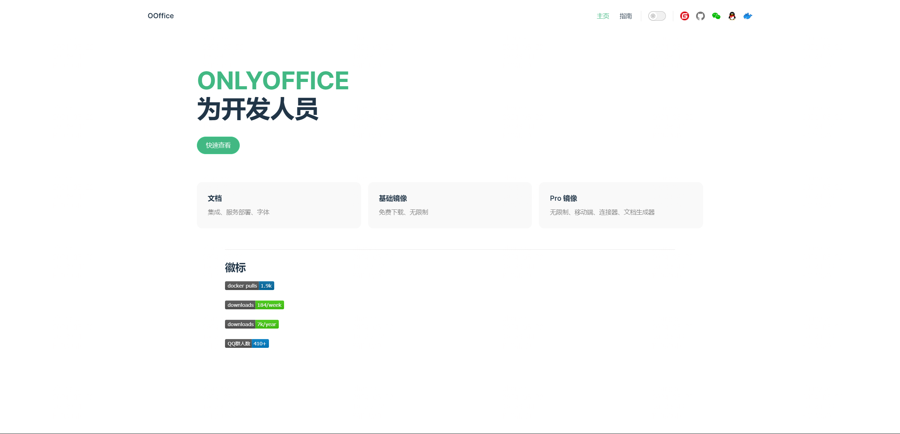

## 介绍

1. 无限制
2. <span style="color:red">提供免费镜像</span>
3. 连接器（自动化 api）
4. 定制服务
5. 咨询服务

## 资源链接

1. [简易文档](https://docs.qq.com/doc/DVHhIcnptc0hEQnJP)
2. [镜像地址](https://hub.docker.com/r/knoxzhang/oo-ce-docker-license)

<!-- ## 徽标 -->

 <!--  -->
 <!-- 
 
 
  -->

<!-- https://img.shields.io/docker/pulls/knoxzhang/oo-ce-docker-license

https://img.shields.io/npm-stat/dy/knox.zhang -->

## 部署

```sh
# 拉取
docker pull knoxzhang/oo-ce-docker-license:8.0.0.1
# 启动
docker run --name=ooffice -i -t -d -p 8080:80 --restart=always knoxzhang/oo-ce-docker-license:8.0.0.1
```

## 快速开始

### 下载

```sh
npm install

# or

yarn install
```

### 启动

```sh
npm run dev
```

### 效果



## 联系方式

QQ：601424688

QQ 交流群：<a href="https://jq.qq.com/?_wv=1027&k=m01BIUzX" target="_blank">792389659</a>


## 捐赠

如果有帮助到您，请作者喝杯咖啡吧

<table>
    <tr>
        <td>
            
        </td>
        <td>
        </td>
        <td>            
            
        </td>
    </tr>
</table>

<!-- 图标下载 https://shields.io/badges/docker-pulls -->
